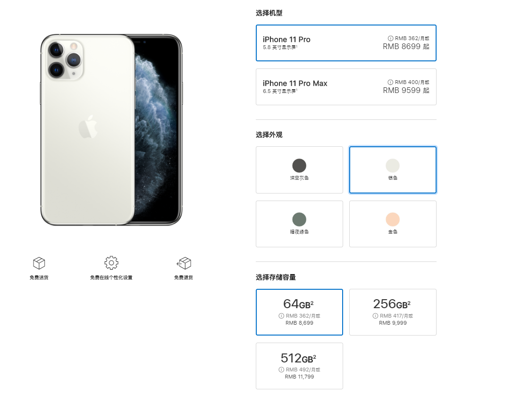
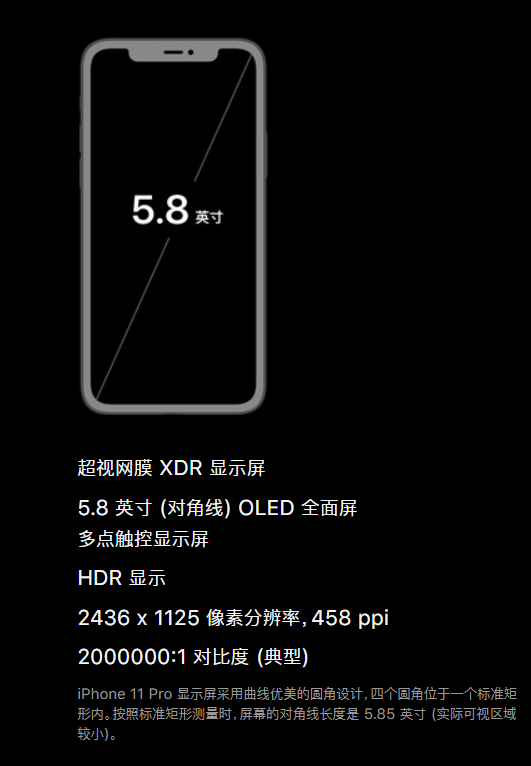

::: tip
电商系统中涉及到商品时必然会遇到的几个概念，SPU、SKU、单品等。彻底搞懂和明白了这几个概念对我们设计商品表是十分必要的前提条件
:::

## SPU：标准化产品单元

SPU全称为Standard Product Unit，译为标准化产品单元。是商品信息聚合的最小单位，是一组可复用、易检索的标准化信息的集合，该集合描述了一个产品的特性。通俗点讲，属性值、特性相同的商品就可以称为一个SPU。

## SKU：库存进出的基本单元

::: tip
买家购买、商家进货、供应商备货、工厂生产都是依据SKU进行的
:::

SKU全称为Stock Keeping Unit，译为库存量单位。即库存进出计量的基本单元。

## 单品

单品是对一种商品而言，当其品牌、型号、配置和等级等属性中任意属性与其它商品不同时，可称为一个单品。
而在连锁零售门店中有时也会称单品为一个SKU。

## 举例说明

**单从上面的三个概念去理解SKU、SPU和单品或许太过于抽象。下面我们举个例子来说明。**

假设我们想买一台手机，并且这台手机是一台苹果手机，那么我们来到了苹果官网。

从上面的图中，我们可以看到，有三种选项供我们选择。

机型：iPhone 11 Pro 、iPhone 11 Pro Max  
外观：深空灰色、银色、暗夜绿色、金色  
存储容量：64GB²、256GB²、512GB²  

假设我们已经选好了这部手机：  
机型：iPhone 11 Pro  
外观：银色  
存储容量：64GB²  

---

从我们想要买手机到确定要买的手机，可划分为四个步骤：

1、选择品牌：iPhone  
2、选择机型：11 Pro  
3、选择外观：银色  
4、选择存储容量：64GB²

当我们选择好了一台手机的品牌和型号：iPhone 11 Pro，那么我们就可以确定一个产品，即SPU

当我们再基于这个选好的产品(iPhone 11 Pro)，再选择这个产品的外观(银色)和存储容量(64GB²)，就是一个SKU

SPU = 品牌 + 型号，即iPhone 11 Pro  
SKU = SPU + 外观 + 存储容量，即iPhone 11 Pro、银色、64GB²  

---

::: tip
SKU是从属于SPU的关系，即一个SPU可以有多个SKU
:::

对于iPhone 11 Pro这个产品(SPU)而言，根据笛卡尔乘积我们可知，一共拥有12个SKU【外观{4} x 存储容量{3}】

SKU是物理上不可分割的最小存货单元。也就是说一款商品(SPU)，可以根据SKU来确定具体的货物存量。

由上面的例子，我们不难发现单凭手机的外观或存储容量我们是不能确认我们要买的这台手机的库存情况的。

同理商家进货补货也是通过SKU来完成的。试问当商家只跟供货商说帮我准备100台iPhone 11 Pro时，却又不告诉供应商手机对应的外观和存储容量，供应商又如何给他备货呢？

::: tip
每个SKU都有其唯一的SKU编码
:::

## SPU和SKU都是属性值的集合

**SPU属性又称关键属性，它并不会影响到库存和价格**

由上图我们可知，iPhone 11 Pro 这款产品，本身就带了很多其它的属性，如尺寸、显示屏、分辨率等等。

但这些属性并不会影响到它的库存和价格，因为每台iPhone 11 Pro无论是不同的外观还是不同的存储容量，它们的这些关键属性都是相同的。

**SKU属性又称销售属性，它会影响到库存和价格**

当我们选择的iPhone 11 Pro的存储容量不同，价格也会不同。

当我们选择的iPhone 11 Pro的外观不同，库存也会不同。如银色可能有100台，金色却只有50台。

## 总结

1）SKU（或称商品SKU）指的是商品子实体。
 
2）商品和商品SKU是主次关系，一个商品包含若干个商品SKU子实体，商品SKU从属于商品。
 
3）SKU不是编码，每个SKU包含一个唯一编码，即SKU Code，用于管理。
 
4）商品本身也有一个编码，即Product Code，但不作为直接库存管理使用。有时为了方便管理，会通过商品的Product Code作为前缀生成SKU Code

## 资料参考

[翎野-商品的spu、sku及其之间的关系](https://www.cnblogs.com/lingyejun/p/9569563.html)
